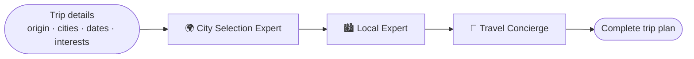

<div align="center">

# ✈️ VacAIgent - CrewAI Trip Planner

**A team of AI agents that picks the best destination, researches it and writes a complete travel itinerary.**


</div>

---

> 📄 **Research context:** this project accompanies the paper *"LLMs and Agentic AI Impact on Tourism Industry 2025"* by **Arash Omranpour** and **Peyman Davoudi**.

## ✨ Features

- 🧭 **Three specialized agents** built with [CrewAI](https://www.crewai.com/):

  | Agent | Goal |
  |---|---|
  | 🌍 City Selection Expert | Choose the best city based on weather, season and prices |
  | 🏙️ Local Expert | Provide the best insights about the selected city |
  | 🧳 Travel Concierge | Produce a day-by-day itinerary with budget and packing suggestions |

- 🛠️ **Tools** the agents can use: web search (Serper), website browsing (Browserless) and a calculator for budgets.
- 🖥️ **Three interfaces** for the same crew: Streamlit web app, FastAPI REST API and a command-line tool.
- 🤖 **Pluggable LLMs** - Gemini 2.0 Flash (default for Streamlit/CLI) or Groq-hosted DeepSeek R1 distill (API).

## 🧩 How it works



See [`flow_diagram.txt`](flow_diagram.txt) for the full diagram.

## 🚀 Getting Started

### Prerequisites

- Python 3.10+
- API keys: `GEMINI_API_KEY` and/or `GROQ_API_KEY`, `SERPER_API_KEY` (search), `BROWSERLESS_API_KEY` (browsing)

### Install

```bash
git clone https://github.com/Arashomranpour/CrewAITripPlanner.git
cd CrewAITripPlanner
pip install -r requirements.txt
```

Create a `.env` file:

```env
GEMINI_API_KEY=...
GROQ_API_KEY=...
SERPER_API_KEY=...
BROWSERLESS_API_KEY=...
```

### Run

**Streamlit app**

```bash
streamlit run streamlit_app.py
```

**REST API** (docs at http://localhost:8000/docs)

```bash
uvicorn api_app:app --reload
```

```bash
curl -X POST http://localhost:8000/api/v1/plan-trip \
  -H "Content-Type: application/json" \
  -d '{"origin": "Mumbai, India", "destination": "Krabi, Thailand",
       "start_date": "2025-06-01", "end_date": "2025-06-10",
       "interests": "swimming, hiking, local food"}'
```

Endpoints: `GET /`, `POST /api/v1/plan-trip`, `GET /api/v1/health`.

**CLI**

```bash
python cli_app.py -o "Bangalore, India" -d "Krabi, Thailand" -s 2024-05-01 -e 2024-05-10 -i "swimming, hiking, food"
```

## 📁 Project Structure

```
.
├── trip_agents.py        # Agent definitions
├── trip_tasks.py         # Task definitions
├── tools/                # Search, browser and calculator tools
├── streamlit_app.py      # Web UI
├── api_app.py            # FastAPI service
├── cli_app.py            # Command-line interface
├── flow_diagram.txt      # Architecture diagram
└── requirements.txt
```

## 🛠️ Tech Stack

`CrewAI` · `LangChain` · `Gemini` · `Groq` · `FastAPI` · `Streamlit` · `Serper` · `Browserless`
